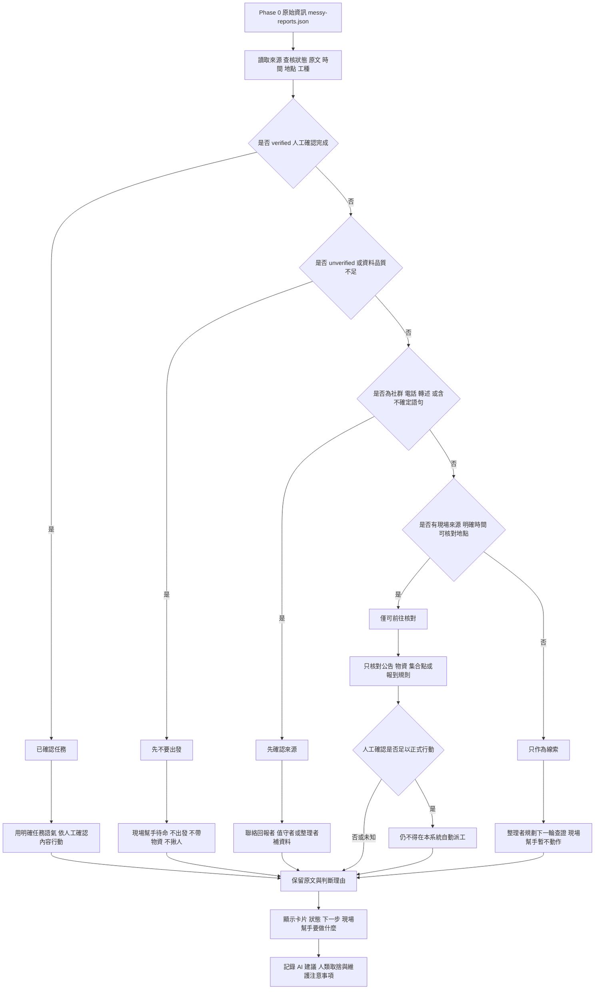

# 資訊流程設計

> 這份文件依 `release-packs/02-flow-design-kit` 產生，用來讓下一位開發者理解 v1 為什麼這樣分類。流程圖是維護參考，不代表真實派工流程。

## 我的 v1 目標

- 我優先服務的使用者：行動者，也就是可能到現場幫忙的人。
- 這個使用者最想完成的事：快速知道自己現在應該執行已確認任務、不要出發、先確認來源、僅可前往核對，或只把資料當成線索。
- 我最想避免的錯誤：把 `工種要求`、`推測地點`、草稿或待確認資料誤看成正式派工。

## 自然語言流程描述

```text
原始資訊仍從 Phase 0 的 messy-reports.json 進入，v1 不新增整理後資料，也不串外部 API。

系統先讀取每筆原始資訊的來源、查核狀態、原文、更新時間、推測地點與可能工種。

如果資料已經人工確認完成，行動者狀態顯示為「已確認任務」。
這是唯一可以用接近任務語氣呈現的狀態，但仍要依現場人工指揮與最新更新行動。

如果資料是 unverified，或資訊品質不足，行動者狀態顯示為「先不要出發」。
現場幫手的具體動作是留在待命狀態，不出發、不帶物資、不揪人。

如果資料來自社群轉錄、電話、轉述，或原文含不知道、不確定、尚未確認、疑似、無法確認等語句，行動者狀態顯示為「先確認來源」。
現場幫手的具體動作是聯絡回報者、值守者或整理者補資料，不自行前往處理。

如果資料來源是現場回報或志工更新，並且有明確時間與可核對地點，且沒有明顯不確定語句，行動者狀態可以顯示為「僅可前往核對」。
這只代表若已由人工安排現場幫手，可以核對公告、物資數量、集合點或報到規則，不代表正式派工、救災、送物資或安全保證。

其他資料顯示為「只作為線索」。
整理者可以拿它規劃下一輪查證，但現場幫手暫時不用動作。

每張卡都要保留原文、來源、查核狀態、推測地點、可能工種、下一步與行動前提醒。
每次 AI 或 Agent 對狀態、文案、流程或 URL 行為做出建議，都要寫進 docs/ai-log.md；如果改變取捨，還要更新 docs/decisions.md。
```

## Mermaid 流程圖

請用 VS Code 預覽這張圖。若未來改狀態規則，請先改本圖再改程式。



## 人工確認點

- 是否可以從「僅可前往核對」進一步變成正式派工，必須由人判斷；目前系統只在 `verificationStatus` 已是 `verified` 時顯示「已確認任務」。
- 推測地點是否足以作為集合點或可前往地址，必須由人判斷。
- 工種要求是否真的符合現場需求，必須由人判斷，不能只靠關鍵字。
- 轉述資訊是否取得當事人同意，必須由人判斷。

## 不能自動處理的分支

- 社群轉錄、電話、轉述或含不確定語句的資訊，不可自動變成可以前往的現場任務。
- `unverified` 資訊不可直接變成任務或出發建議。
- `僅可前往核對` 不可自動升級成正式派工。
- 系統不可自動判斷路線、安全、現場優先順序或是否該送物資。

## 操作或判斷紀錄

- AI 或 Agent 建議新增、刪除、重新命名狀態時，記錄在 `docs/ai-log.md`。
- 人類決定主要使用者、採用或拒絕 AI 建議時，記錄在 `docs/decisions.md`。
- 流程圖或狀態規則改變時，更新本檔案，讓接手者先看流程再改程式。
- 因部署環境造成的行為差異也要記錄，例如 GitHub Pages 需要 build 後產生 `dist/v1/index.html`，避免 `/v1/` 造成 404。

## 我檢查後修正了什麼

- 原本：流程容易把「可以出發」畫成最終可行動狀態。
- 修正後：改成「僅可前往核對」，並新增「已確認任務」分支；只有 `verified` 資訊可以用任務語氣呈現。
- 為什麼：`docs/design-checklist.md` 要求流程不能讓 AI 自動決定救災、派工或行動優先順序。

## 我仍不確定的流程點

- 行動者需要看到多少原文才足以理解風險，而不會只看狀態標籤行動。
- `僅可前往核對` 是否需要再細分成公告確認、物資盤點、集合點確認。
- 若未來加入真正人工確認者角色，確認紀錄要如何顯示，才不會被誤看成正式派工。
